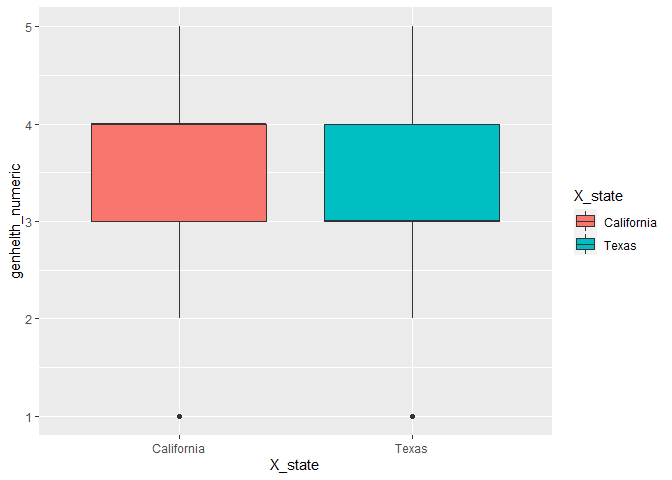
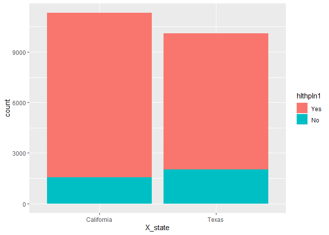
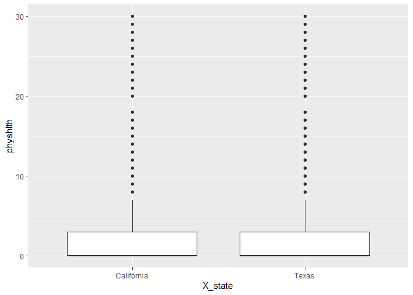
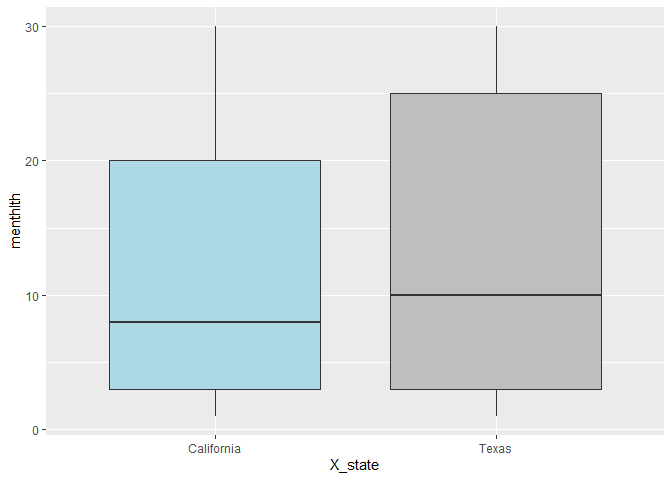
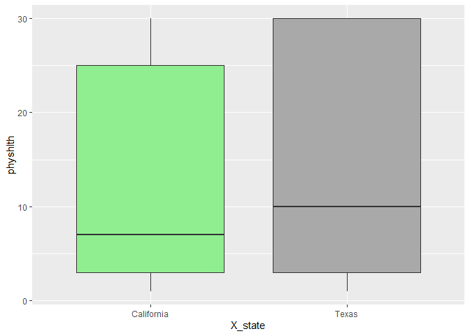
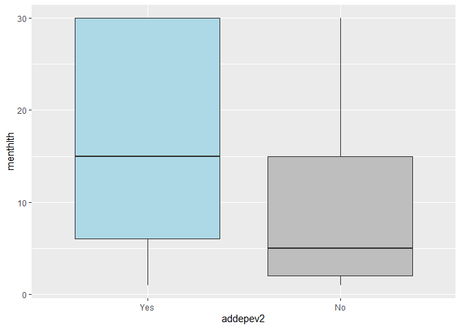
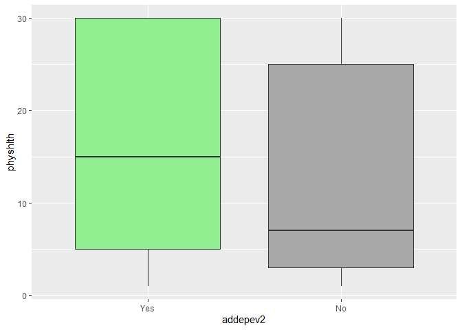
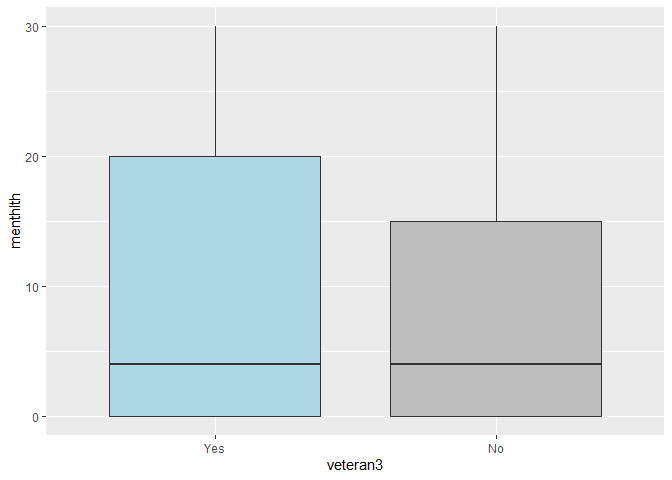
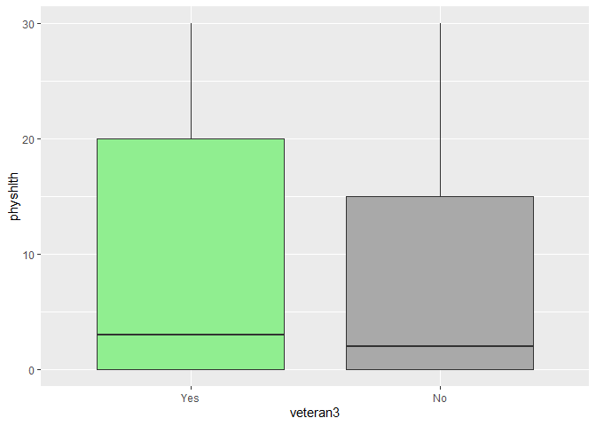

Exploring the BRFSS dataset
================
Mobin A Piracha
11/29/2020

## Setup

### Load packages

``` r
library(tidyverse)
```

    ## Warning: package 'tidyr' was built under R version 4.0.3

    ## Warning: package 'readr' was built under R version 4.0.3

### Load data

Make sure your data and R Markdown files are in the same directory. When
loaded your data file will be called `brfss2013`. Delete this note when
before you submit your work.

``` r
load("~/MyFolder/The Essentials for Data Science/Coursera/Intro_to_Probability_Data/R_Assignments/brfss2013.Rdata")
```

-----

## Part 1: Data

Question: Describe how the observations in the sample are collected, and
the implications of this data collection method on the scope of
inference (generalizability / causality). Note that you will need to
look into documentation on the BRFSS to answer this question. See
<http://www.cdc.gov/brfss/> as well as the “More information on the
data” section below.

Answer: The data is collected through a collaborative project between
the all the United States and participating territories. It’s a survey
provided by the Central for Control and Diseases and asks question
regarding several health indicators such as tabacco use, HIV/AIDs,
immunization, exercise etc. It is a landline and cellular telephone
survey. The survey interviews collects data from a randomly selected
adult in a household using landline survey and survey collects data from
an adult that resides in college housing or private residence using the
cellular telephone version of the survey. In this survey the population
is the non-institutionalized adults (18 year and older) in the United
States. The sampling indicates that individuals are randomly selected
through a telephone survey. In addition, the survey interviews a
randomly selected adult in a household due to which we can infer some
level of independence between observations since people who are related
are less likely to be interviews. However, prison and homeless
population is left out of the sample because homeless people do not have
a permamnent address and incarcerated individuals are not interviewed
which might bias the results slightly as poorer and incarcerated
individuals probably have much poorer health. However, since we do have
some type of random sampling we have some evidence for inference for
generalizability. Since this is simply a survey and we are not testing
any hypothesis such as an intervention, there is no random assignemnt
and therefore, the data will show results that are generalizable but not
causal

-----

## Part 2: Research questions

Research questions: (11 points) Come up with at least 2 research
questions that you want to answer using these data. You should phrase
your research questions in a way that matches up with the scope of
inference your dataset allows for. Make sure that at least two of these
questions involve at least three variables. You are welcomed to create
new variables based on existing ones. With each question include a brief
discussion (1-2 sentences) as to why this question is of interest to you
and/or your audience.

For this analaysis we’ll narrow down our analysis into two states for
simplicity, Texas and California.

**Research quesion 1:**

Is there is a difference between healthcare coverage for individuals in
Texas compared to individuals in california? Does healthcare coverage
affect mental and physical health responses in both states? Do these
responses differ based on sex.

**Research quesion 2:**

How is quality of health of veterans in both states. How does veteran
healthcare and sleep compare to that of non-veterans in the sample? How
are physical and mentalh health indicators different from veterans to
non-veterans? Within veterans, how do health indicators differ from
veterans who have ever been told they have a depressive disorder. \* \*
\*

## Part 3: Exploratory data analysis

**Research quesion 1:**

First let’s take care of some of the NA values

``` r
brfssTexCal_clean <- brfssTex_Cal %>% 
  select(X_state,fmonth,idate,imonth, idate,iyear,dispcode, sex,genhlth,physhlth,menthlth,hlthpln1,medcost) %>% filter(!is.na(genhlth),!is.na(physhlth),!is.na(menthlth),!is.na(hlthpln1),!is.na(medcost))
```

``` r
brfssTexCal_clean %>% 
  str()
```

    ## 'data.frame':    21422 obs. of  12 variables:
    ##  $ X_state : Factor w/ 55 levels "0","Alabama",..: 6 6 6 6 6 6 6 6 6 6 ...
    ##  $ fmonth  : Factor w/ 12 levels "January","February",..: 1 1 1 7 1 1 1 1 1 1 ...
    ##  $ idate   : int  5152013 6032013 6182013 9032013 5112013 5072013 5132013 5152013 3272013 4212013 ...
    ##  $ imonth  : Factor w/ 12 levels "January","February",..: 5 6 6 9 5 5 5 5 3 4 ...
    ##  $ iyear   : Factor w/ 2 levels "2013","2014": 1 1 1 1 1 1 1 1 1 1 ...
    ##  $ dispcode: Factor w/ 2 levels "Completed interview",..: 2 2 2 2 2 1 2 2 2 1 ...
    ##  $ sex     : Factor w/ 2 levels "Male","Female": 2 1 2 2 2 2 2 1 2 1 ...
    ##  $ genhlth : Factor w/ 5 levels "Excellent","Very good",..: 3 1 1 3 2 3 3 3 2 1 ...
    ##  $ physhlth: int  0 0 0 20 0 0 0 0 2 0 ...
    ##  $ menthlth: int  5 3 0 30 0 1 7 0 0 1 ...
    ##  $ hlthpln1: Factor w/ 2 levels "Yes","No": 1 1 1 2 1 1 1 1 1 1 ...
    ##  $ medcost : Factor w/ 2 levels "Yes","No": 2 2 2 2 2 2 2 2 1 2 ...

``` r
brfssTexCal_clean %>% 
  group_by(X_state) %>% 
  summarise(count = n())
```

    ## `summarise()` ungrouping output (override with `.groups` argument)

    ## # A tibble: 2 x 2
    ##   X_state    count
    ##   <fct>      <int>
    ## 1 California 11317
    ## 2 Texas      10105

``` r
# We have nearly equal number of observations in both states
```

Let’s calculate the mean general health for residents in Texas and
California. We find that general health is in factors with ranges from
Excellent to Poor. We want to change this factor to numeric into levels
with 5 Excelent, 4 is Vert good, 3 is Good, 2 is Fair and 1 is Poor. We
also find out the proportion of people in Texas and California who have
health coverage. We code 1 for Yes and 0 for No in Health Coverage

``` r
brfssTexCal_clean$genhelth_numeric <- brfssTexCal_clean$genhlth
levels(brfssTexCal_clean$genhelth_numeric) <- c(5,4,3,2,1)
brfssTexCal_clean$genhelth_numeric <- as.character(brfssTexCal_clean$genhelth_numeric)
brfssTexCal_clean$genhelth_numeric <- as.numeric(brfssTexCal_clean$genhelth_numeric)
unique(brfssTexCal_clean$genhelth_numeric)
```

    ## [1] 3 5 4 2 1

``` r
brfssTexCal_clean$hlthpln1_numeric <- brfssTexCal_clean$hlthpln1
unique(brfssTexCal_clean$hlthpln1_numeric)
```

    ## [1] Yes No 
    ## Levels: Yes No

``` r
brfssTexCal_clean <- brfssTexCal_clean %>% 
  mutate(hlthpln1_numeric = ifelse(hlthpln1_numeric == "Yes",1,0))
unique(brfssTexCal_clean$hlthpln1_numeric)
```

    ## [1] 1 0

``` r
brfssTexCal_clean %>% 
  group_by(X_state) %>% 
  summarise(mean_genhelth = mean(genhelth_numeric), sd_genhelth = sd(genhelth_numeric),median_genhelth = median(genhelth_numeric))
```

    ## `summarise()` ungrouping output (override with `.groups` argument)

    ## # A tibble: 2 x 4
    ##   X_state    mean_genhelth sd_genhelth median_genhelth
    ##   <fct>              <dbl>       <dbl>           <dbl>
    ## 1 California          3.51        1.12               4
    ## 2 Texas               3.35        1.11               3

``` r
brfssTexCal_clean %>% 
  group_by(X_state) %>% 
   summarise(mean(hlthpln1_numeric))
```

    ## `summarise()` ungrouping output (override with `.groups` argument)

    ## # A tibble: 2 x 2
    ##   X_state    `mean(hlthpln1_numeric)`
    ##   <fct>                         <dbl>
    ## 1 California                    0.863
    ## 2 Texas                         0.799

``` r
brfssTexCal_clean %>% 
  group_by(X_state, hlthpln1_numeric) %>% 
  summarise(mean_genhelth = mean(as.double(genhelth_numeric)))
```

    ## `summarise()` regrouping output by 'X_state' (override with `.groups` argument)

    ## # A tibble: 4 x 3
    ## # Groups:   X_state [2]
    ##   X_state    hlthpln1_numeric mean_genhelth
    ##   <fct>                 <dbl>         <dbl>
    ## 1 California                0          3.24
    ## 2 California                1          3.55
    ## 3 Texas                     0          3.14
    ## 4 Texas                     1          3.40

We find that California has a better average general health than Texas,
with roughly around the same standard deviation. California has an
average general health of 3.50 relative to California’s 3.35. California
also has a higher median (4) compared to Texas (2). Therefore, we can
generalize than individuals California have better health outcomes than
individuals in California. We also find that a larger proportion of
people in California (0.8632) have health coverage relative to Texas
(0.7987). We also find that in both states individuals with health
coverage scored higher than individuals without health coverage.
However, correlation does not necessarily mean causation as there might
be other confounders that might cause individuals with access to
healthcare to have better health.

Let’s visualize our analysis.

``` r
ggplot(data = brfssTexCal_clean) + 
  geom_boxplot(mapping = aes(x = X_state, y = genhelth_numeric, fill = X_state))
```

<!-- -->

``` r
ggplot(data = brfssTexCal_clean) + 
  geom_bar(mapping = aes(x = X_state, fill = hlthpln1))
```

<!-- -->

Now let’s talk about other indicators such as physhlth which is number
of days in the past 30 dats where physical health was not good) and
menthlth which is number of days in the past 30 days where mental health
was not good. Are the indicators different based on gender?

``` r
brfssTexCal_clean %>%
  group_by(X_state, sex) %>% 
  summarise(mean_physical_health_days = mean(physhlth), mean_mental_health_days = mean(menthlth))
```

    ## `summarise()` regrouping output by 'X_state' (override with `.groups` argument)

    ## # A tibble: 4 x 4
    ## # Groups:   X_state [2]
    ##   X_state    sex    mean_physical_health_days mean_mental_health_days
    ##   <fct>      <fct>                      <dbl>                   <dbl>
    ## 1 California Male                        3.79                    3.36
    ## 2 California Female                      4.53                    4.06
    ## 3 Texas      Male                        3.31                    2.31
    ## 4 Texas      Female                      4.64                    3.49

``` r
brfssTexCal_clean %>% 
  group_by(X_state) %>% 
    summarise(mean_physical_health_days = mean(physhlth), mean_mental_health_days = mean(menthlth))
```

    ## `summarise()` ungrouping output (override with `.groups` argument)

    ## # A tibble: 2 x 3
    ##   X_state    mean_physical_health_days mean_mental_health_days
    ##   <fct>                          <dbl>                   <dbl>
    ## 1 California                      4.20                    3.75
    ## 2 Texas                           4.11                    3.01

California does worse than Texas in both average physical and mental
health days. Since the indicators are the number of days that were not
good for the past 30 days a higher average means worse physcial and
mental health outcomes. Therefore, Texas (3.01) does much better than
California in mean mental health (3.74) days, and Texas (4.1) does
relatively better in Physical health days than California (4.2). When
divisions based on gender, we find that men do better than women in both
Texas and California when it comes to both physical and mental health.
For men in Texas, their average physical and mental health days are 3.31
and 2.31 respectively. For women in Texas, their average physical and
mental health days are 4.63 and 3.48. For men in California their
average physical and mental health days are 3.79 and 3.36 while women do
relatively worse in physical and mental health with 4.53 and 4.05. In
one case women in Texas do slightly worse than women in california when
it comes to physical health as women average physical health days in
Texas are 4.63 while in California are 4.53.

We find that many observations for physical health and mental health are
0. We can do this by trying to visualize them using a boxplot.

``` r
ggplot(data = brfssTexCal_clean) +
  geom_boxplot(mapping = aes(x = X_state, y = physhlth))
```

<!-- -->

Therefore, it might be more beneficial to filter the data and do
analysis on cases where both number of bad physical and mental health
days are greater than 0, since 0 is skewing the distribution and not
allowing us to look at the data objectively. Filtering for observations
greater than 0 might give us a better indication of physical and mental
health problems within the state, it may allow us to conduct analysis on
the proportion of the population where physical and mental health
problems are more prevalant.

``` r
brfssTexCal_clean %>% 
  filter(physhlth >0, menthlth>0) %>% 
  group_by(X_state, sex) %>% 
  summarise(mean_physical_health_days = mean(physhlth), mean_mental_health_days = mean(menthlth),median_physical_health_days = median(physhlth), median_mental_health_days = median(menthlth),IQR_physical_health_days = IQR(physhlth), IQR_mental_health_days = IQR(menthlth))
```

    ## `summarise()` regrouping output by 'X_state' (override with `.groups` argument)

    ## # A tibble: 4 x 8
    ## # Groups:   X_state [2]
    ##   X_state sex   mean_physical_h~ mean_mental_hea~ median_physical~
    ##   <fct>   <fct>            <dbl>            <dbl>            <dbl>
    ## 1 Califo~ Male              12.9             12.8                7
    ## 2 Califo~ Fema~             12.3             11.9                7
    ## 3 Texas   Male              12.8             12.9                7
    ## 4 Texas   Fema~             13.5             13.2               10
    ## # ... with 3 more variables: median_mental_health_days <dbl>,
    ## #   IQR_physical_health_days <dbl>, IQR_mental_health_days <dbl>

``` r
brfssTexCal_clean %>% 
  filter(physhlth >0, menthlth>0) %>% 
  group_by(X_state) %>% 
    summarise(mean_physical_health_days = mean(physhlth), mean_mental_health_days = mean(menthlth),median_physical_health_days = median(physhlth), median_mental_health_days = median(menthlth),IQR_physical_health_days = IQR(physhlth), IQR_mental_health_days = IQR(menthlth))
```

    ## `summarise()` ungrouping output (override with `.groups` argument)

    ## # A tibble: 2 x 7
    ##   X_state mean_physical_h~ mean_mental_hea~ median_physical~ median_mental_h~
    ##   <fct>              <dbl>            <dbl>            <dbl>            <dbl>
    ## 1 Califo~             12.5             12.3                7                8
    ## 2 Texas               13.3             13.1               10               10
    ## # ... with 2 more variables: IQR_physical_health_days <dbl>,
    ## #   IQR_mental_health_days <dbl>

We see that as we’ve filtered out the 0s our mean has changed
drastically from single to double digits. After filtering out the zeros
we find that California does better than Texas in both average physical
and mental health days. Therefore, filtering out the zeros changes our
analysis drastically. Since the indicators are the number of days that
were not good for the past 30 days a higher average means worse physical
and mental health outcomes. Therefore, California (12.26) now does much
better than Texas (13.09) in mean mental health days, and California
(12.53) also does relatively better in physical health days than Texas
(13.32). When divisions based on gender, we find that women do better
than men in California when it comes to both average physical and mental
health days and men do better than women in Texas when it comes to both
average physical and mental health days. For men in Texas, their average
physical and mental health days are 12.79 and 12.86 respectively. For
women in Texas, their average physical and mental health days are 13.55
and 12.19. For men in California their average physical and mental
health days are 12.86 and 12.80 while women do relatively better in
physical and mental health with 12.34 and 11.94. Therefore, for cases
where number of bad mental and physical health days are greater than 0,
our mean drastically increases in all cases and our analysis changes as
well. This means that among individuals that have at least one bad
mental or physical health day, they are facing significant physical and
mental health problem, which is shown through the increase from single
digit to double digit. California also has a lower median physical and
mental health days and a lower interquartile range.

Let’s try seeing how removing our 0s affects our boxplot.

``` r
brfssTexCal_clean %>% 
  filter(physhlth >0, menthlth>0) %>% 
  ggplot() +
  geom_boxplot(mapping = aes(x = X_state, y = menthlth), fill = c("lightblue","grey")) 
```

<!-- -->

``` r
brfssTexCal_clean %>% 
  filter(physhlth >0, menthlth>0) %>% 
  ggplot() +
  geom_boxplot(mapping = aes(x = X_state, y = physhlth), fill = c("lightgreen","darkgrey")) 
```

<!-- -->

The boxplot allows us to see a better distribution of our data. Our
mental health boxplot shows us different distributional indicators for
the number of bad mental health days out of 30 days in California and
Texas. The dark line in the middle of the box is the median. Interesting
we found that the mean physical and mental health days were lower for
Texas than California. After filtering out our zeros we find that the
median values for both bad physcial and mental health days are higher
for Texas with median of around 10 for Texas and 7 for California for
bad physical health days. Similarly the median bad mental health days
are higher for Texas with 10 as compared to around 8 for California. In
addition, we find that the range for Texas is much larger as we Texas
has a much bigger box than California, which corroborates our analysis
for Texas having a higher interquartile range than California. A higher
interquartile range means there is a larger gap between the median upper
half (75%) of the data and the median lower half (25%) of the data. Keep
in mind that our previous analysis did not leave out the zeros while
this analysis we filter them out to understand our distribution better.

**Research quesion 2:**

Our next question deals with the healthcare of veterans. It deals with
the general, physical and mental health of veterans and their quality of
sleep. We can also analyse these indicators by grouping them based on
gender. Let’s select our variables

``` r
brfss_Veterans <- brfss2013 %>% 
  select(X_state,fmonth,idate,imonth,idate,iyear,dispcode,veteran3,sex,genhlth,physhlth,menthlth,sleptim1,addepev2) 
```

Let’s get rid of all NAs from our data. Also let’s repeat some of our
conversions from factors to numerics for our data.

``` r
brfss_Veterans_clean <- brfss_Veterans %>% 
  select(X_state,fmonth,idate,imonth,idate,iyear,dispcode,sex,genhlth,physhlth,menthlth,sleptim1, veteran3,addepev2) %>% 
  filter(!is.na(genhlth),!is.na(physhlth),!is.na(menthlth),!is.na(sleptim1),!is.na(sex),!is.na(veteran3),!is.na(addepev2))

brfss_Veterans_clean$genhelth_numeric <- brfss_Veterans_clean$genhlth
unique(brfss_Veterans_clean$genhelth_numeric)
```

    ## [1] Good      Very good Fair      Excellent Poor     
    ## Levels: Excellent Very good Good Fair Poor

``` r
levels(brfss_Veterans_clean$genhelth_numeric) <- c(5,4,3,2,1)
brfss_Veterans_clean$genhelth_numeric <- as.numeric(as.character(brfss_Veterans_clean$genhelth_numeric))

brfss_Veterans_clean %>%   
  filter(physhlth >0, menthlth>0) %>% 
  group_by(veteran3) %>% 
  summarise(mean_sleep = mean(sleptim1), mean_general_health = mean(genhelth_numeric), mean_physical_health_days = mean(physhlth), mean_mental_health_days = mean(menthlth))
```

    ## `summarise()` ungrouping output (override with `.groups` argument)

    ## # A tibble: 2 x 5
    ##   veteran3 mean_sleep mean_general_heal~ mean_physical_healt~ mean_mental_healt~
    ##   <fct>         <dbl>              <dbl>                <dbl>              <dbl>
    ## 1 Yes            6.64               2.45                 15.1               14.1
    ## 2 No             6.74               2.69                 12.5               12.4

``` r
brfss_Veterans_clean %>% 
  group_by(veteran3, addepev2) %>% 
  summarise(mean_sleep = mean(sleptim1), mean_general_health = mean(genhelth_numeric), mean_physical_health_days = mean(physhlth), mean_mental_health_days = mean(menthlth))
```

    ## `summarise()` regrouping output by 'veteran3' (override with `.groups` argument)

    ## # A tibble: 4 x 6
    ## # Groups:   veteran3 [2]
    ##   veteran3 addepev2 mean_sleep mean_general_he~ mean_physical_h~
    ##   <fct>    <fct>         <dbl>            <dbl>            <dbl>
    ## 1 Yes      Yes            6.76             2.77             9.88
    ## 2 Yes      No             7.17             3.46             3.75
    ## 3 No       Yes            6.89             2.94             8.30
    ## 4 No       No             7.08             3.60             3.14
    ## # ... with 1 more variable: mean_mental_health_days <dbl>

We initially do our analysis comparing veterans and non-veterans on a
number of indicators such as sleep time, general health, physical and
mental health indicators but we find little or no difference. Therefore,
we group our data into both veterans and non-veterans, and those
individuals with and without a depressive disorder. We find that
veterans that have ever been told they have a depressive disorder do
much worse on all indicators than veterans and non-veterans. They sleep
less with average of 6.76 hours of sleep, a general health of 2.77, a
greater number of physical health days of 9.877 and also a greater
number of bad mental health days of 10.122. Veterans who answered no on
depressive disorder sleep better with 7.16 hours of sleep, have better
general health of 3.46, have on average lower physical health days of
3.75 and the lowest mental health days of all four categories of 1.33.
Therefore, we find that veterans without a depressive disorder have
roughly around the same health as non-veterans without a depressive
disorder and in fact do even better on some indicators. However,
veterans with depressive disorders have much worse health outcomes.
Therefore, investing in veterans health may be important for improving
the dismal health indicators for veterans with some sort of mental
health problems.

Let’s compare veterans with a depressive disorder to veterans without a
depressive disorder through a boxplot

``` r
brfss_Veterans_clean_1 <- brfss_Veterans_clean %>% 
  filter(veteran3 == "Yes") 

brfss_Veterans_clean_1 %>% 
  filter(physhlth >0, menthlth>0) %>% 
  ggplot() +
  geom_boxplot(mapping = aes(x = addepev2, y = menthlth), fill = c("lightblue","grey")) 
```

<!-- -->

``` r
brfss_Veterans_clean_1 %>% 
  filter(physhlth >0, menthlth>0) %>% 
  ggplot() +
  geom_boxplot(mapping = aes(x = addepev2, y = physhlth), fill = c("lightgreen","darkgrey"))
```

<!-- -->

We first filter the data such that we only get veterans in our dataset.
Creating this boxplot allows us to do analysis within veterans with and
without a depressive disorder. Once again, we find that if we account
for people with 0 bad mental and physical health days, our boxplot ends
up being unusual, therefore, we filter our data only accounting for
individuals with at least 1 mental health day and therefore, we get a
boxplot. Our boxplot shows a huge difference between Veterans with
depressive disorder and those without. We find that veterans with a
depressive disorder have much higher bad physical and mental health days
than those that don’t. Veterans with depressive disorder have higher
median values, and a much larger upper and lower quartile.

Let’s now compare veterans and non-veterans with and without a
depressive disorder. Let’s first compare veterans with a depressive
disorder to non-veterans with a depressive disorder.

``` r
brfss_Veterans_clean_2 <- brfss_Veterans_clean %>% 
  filter(addepev2 == "Yes")

brfss_Veterans_clean_2 %>% 
  ggplot() +
  geom_boxplot(mapping = aes(x = veteran3, y = menthlth), fill = c("lightblue","grey")) 
```

<!-- -->

``` r
brfss_Veterans_clean_2 %>% 
  ggplot() +
  geom_boxplot(mapping = aes(x = veteran3, y = physhlth), fill = c("lightgreen","darkgrey"))
```

<!-- -->

We find that the range for veterans with a depressive disorder is much
higher than non-veterans with a depressive disorder even though the
median is the same. In this case we ended up sticking with zeros as
keeping out the zeros didn’t make our boxplot unusual. This is most
likely because people with depressive disorder are very likely to have
at least one bad mental or physical health day, and therefore, we don’t
have too many zeros in our observations.
